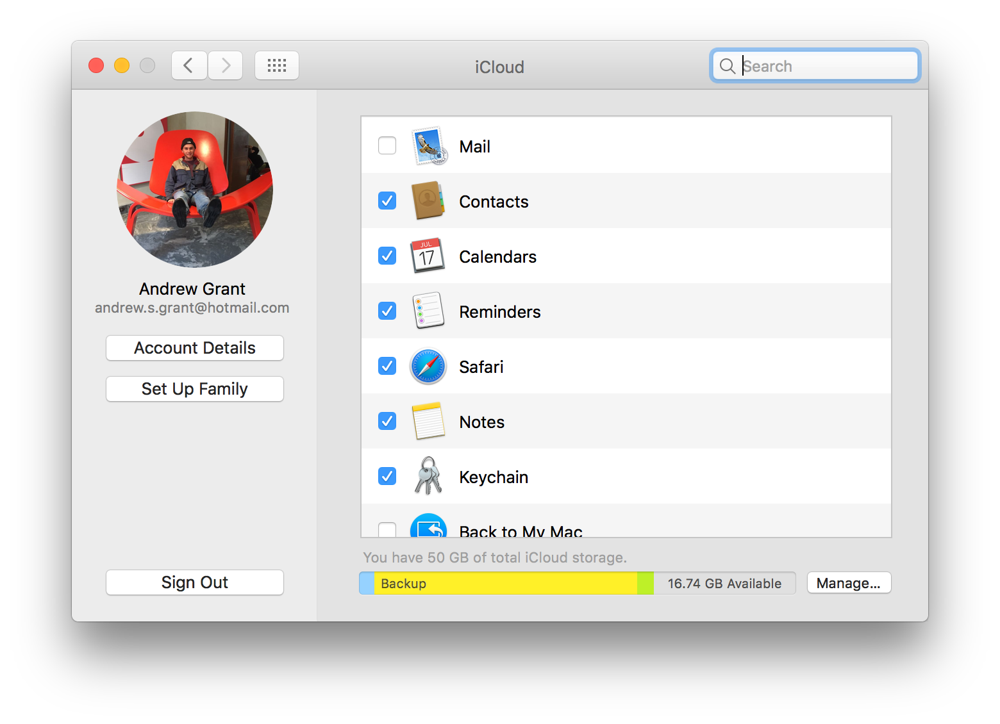
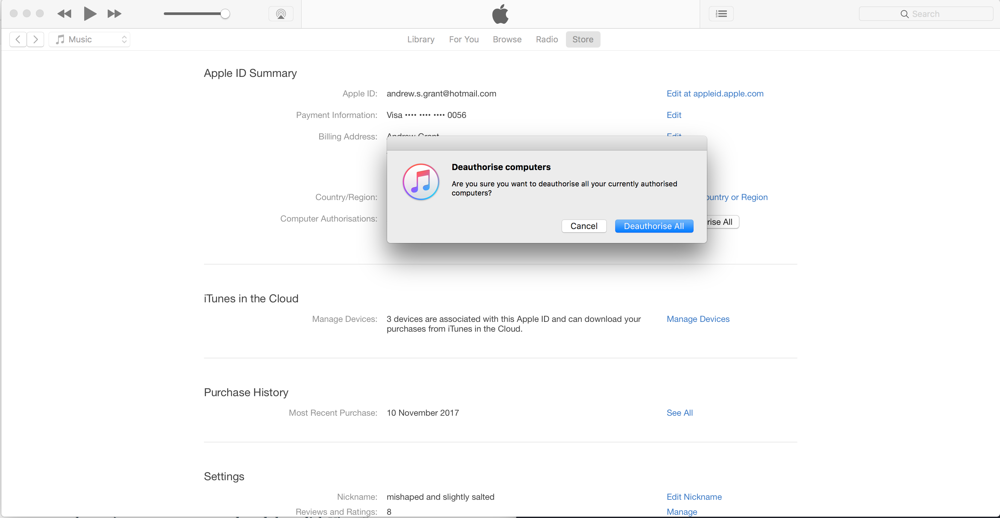

# Follow these simple steps and your computer will be squeaky clean in no time my

##### Disclaimer - I (andy) do not take any responsibility for loss of files, damage to computers etc etc etc... 2017 Friday etc

## Backup important files
1. Backup all of your files that you wish to keep onto an external hardrive or stick them in the cloud (be extra careful & make sure you don't forget any because they will be lost forever)

 * /Pictures folder
 * /Movies folder
 * /Music folder
 * /Documents folder
 * /Kath's big ass folder of selfies
 * Stickies
 * Passwords anywhere
 * Check that your bookmarks/calendars/notes etc are backedup up in iCloud -> System Preferences/iCloud and make sure that the "Safari, Calendars & Notes" check boxes are ticked
 
 
 

## Deauthorize iTunes
2. iTunes only allows you to use up to five computers to use stuff from your Apple ID and if you don't deauthorize it before you wipe the ting it will think its another computer
  1. Click iTunes Store button (middle top)
  2. Scroll to the bottom of the page and there is the tiniest Account button 🔎🔎🔎
  3. In the Account Information window, click Deauthorize All

### Here's some related links you might find useful before the erasing hard drive and reinstalling the OS
  * http://www.gizmodo.co.uk/2015/04/make-your-mac-feel-like-new-again-with-a-fresh-install-of-os-x/
  * http://www.asianefficiency.com/technology/format-mac-checklist/
  * https://gigaom.com/2011/01/21/mac-maintenance-an-os-x-reinstall-checklist/

## Reinstall macOS 💀
Make sure you know your AppleID/Wifi credentials because you will need them when you install the new operating system. The current one now in macOS High Sierra btwwwww. There is a guide on Apple's own website that has the steps so I will just link that rather than copying. I would erase the startup disk and then install the new OS so it is completely wiped.

https://support.apple.com/en-gb/HT204904

# Badman
Take some time to reflect on how much of a badman you are 🦑, no motherfucking virus is guna stop this honey.
Hold tight for silky smooth 🤞

Hope this helps!
Andy
